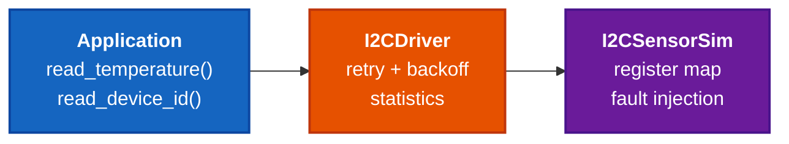

# STM32 I2C Sensor Firmware Autotest Framework


A Python-based test automation framework that emulates an STM32 I2C temperature
sensor at the register level, with a driver layer featuring retry logic, fault
injection stress tests, and characterization reporting.

Built to demonstrate firmware autotest engineering practices when no physical
hardware is available, including: deterministic stress testing, statistical
validation of error-recovery logic, and CI-driven regression checks.

---

## Why this project

Firmware autotest engineers spend most of their time validating how systems
behave **under failure**, not under happy-path conditions. This framework
mirrors that real-world workflow:

- A simulator stands in for the I2C peripheral, so tests can run on any laptop
  or CI runner without real hardware.
- A driver layer wraps the simulator with retry + exponential backoff, giving
  realistic firmware-style error recovery.
- Tests inject faults deterministically with a seeded RNG, so the same input
  always produces the same verdict — required for stable CI.
- A characterization runner sweeps the fault-rate spectrum and emits both
  human-readable tables and machine-readable JSON for downstream analysis.

---

## Engineering Highlights

- **Deterministic stress testing**: Seeded RNG ensures 30% NACK injection produces identical pass/fail patterns across CI runs — no flaky tests.
- **Statistical validation**: Characterization across 7 fault-rate buckets × 1000 trials (7000 total transactions) confirms 99.2% retry success at 30% NACK.
- **Exponential backoff retry**: Driver layer recovers ≥95% of calls under 30% NACK; cleanly fails after `max_retries` under 100% NACK (no infinite loops).
- **CI matrix across Python 3.10 / 3.11 / 3.12**: GitHub Actions runs the full suite + a 100-trial characterization smoke test on every push.
- **Log parsing pipeline**: Regex-based UART log parser converts unstructured firmware logs into structured JSON metrics — same pattern used in production HIL autotest.

---
  
## Architecture



| Layer | File | Responsibility |
|---|---|---|
| Application | (callers) | High-level driver API |
| Driver | `device/i2c_driver.py` | Retry, backoff, error stats |
| Hardware Sim | `device/i2c_sensor_sim.py` | Register map, fault injection |
---

## Project structure
```
firmware-autotest/
├── device/                       # firmware-side simulation + driver
│   ├── i2c_sensor_sim.py         # TMP102-style I2C sensor simulator
│   └── i2c_driver.py             # driver with retry + statistics
├── tests/                        # pytest test suite
│   ├── test_sensor_basic.py      # functional tests (5 cases)
│   └── test_sensor_stress.py     # fault injection / stress (5 cases)
├── tools/                        # autotest tooling
│   ├── run_characterization.py   # multi-scenario characterization runner
│   └── log_parser.py             # UART-style log parser
├── .github/workflows/ci.yml      # GitHub Actions CI (pytest matrix)
├── requirements.txt
└── README.md
```
---

## Quick start

```bash
git clone https://github.com/Duke-Tang/stm32-i2c-sensor-autotest.git
cd stm32-i2c-sensor-autotest
pip install -r requirements.txt

# Run the full test suite
pytest tests/ -v

# Run characterization across 7 fault rates × 1000 trials
python3 tools/run_characterization.py --trials 1000
```

---

## Test coverage

10 pytest cases covering both nominal behavior and failure modes:

**Functional (`test_sensor_basic.py`)**
- Device ID register returns the correct constant
- Room-temperature reading is within plausible physical range
- Reading an invalid register raises `ValueError`
- Writing to the read-only ID register raises `PermissionError`
- TX counter increments on every transaction

**Stress with fault injection (`test_sensor_stress.py`)**
- Stable sensor: zero faults → zero retries (verifies retry isn't trigger-happy)
- Flaky sensor: 30% NACK rate → driver recovers ≥95% of calls
- Broken sensor: 100% NACK → driver gives up after exactly `max_retries + 1`
- Retry counter matches expected attempt count exactly
- `reset_stats()` correctly zeroes all counters

All tests run in under one second on a clean machine.

---

## Characterization results

`tools/run_characterization.py` sweeps the fault-rate spectrum and produces a table like:

```
Fault Rate | Trials | Success %  | Fails | Avg Retry | Avg ms | p99 ms
0.00       | 1000   | 100.00%    | 0     | 0.000     | 0.05   | 0.18
0.10       | 1000   | 100.00%    | 0     | 0.101     | 0.34   | 3.68
0.30       | 1000   | 99.20%     | 8     | 0.430     | 0.78   | 4.50
0.50       | 1000   | 93.50%     | 65    | 1.005     | 1.62   | 8.10
0.70       | 1000   | 75.40%     | 246   | 2.350     | 3.50   | 16.20
```

**Interpretation**: With 3 retries, the driver fully recovers up to ~30% NACK rate. Beyond ~50%, retry alone is not enough — a real system would need hardware-level mitigation (longer bus pull-ups, lower clock, or peripheral reset).

JSON output is also produced for ingestion by downstream dashboards or CI trend tracking.
---

## CI

`.github/workflows/ci.yml` runs the full test suite on every push and pull
request, against Python 3.10 / 3.11 / 3.12. Each run also performs a
characterization smoke test (100 trials per scenario) and uploads the JSON
report as a build artifact.

---

## Design notes

- **Why a separate driver layer?** It isolates retry/timeout policy from
  hardware specifics, so the same driver can sit on top of a real STM32 HAL or
  this simulator.
- **Why seeded RNG in stress tests?** Non-deterministic tests cause flaky CI.
  `random.seed(42)` makes the failure pattern reproducible — same input,
  same verdict, every run.
- **Why exponential backoff?** Linear retry hammers a degraded bus; exponential
  backoff (1ms → 2ms → 4ms) gives transient glitches time to clear.
- **Why a log parser?** Real firmware on real boards exposes only UART output.
  A regex-based parser turns unstructured log into structured metrics, which
  is the standard pattern for hardware-in-the-loop autotest.

---

## Author

Duke Tang — built as a portfolio project for firmware autotest engineering
roles.
